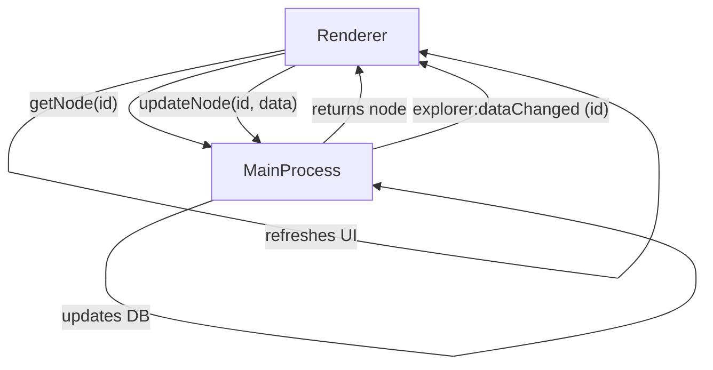

# Explorer Storage Engineering Doc

## Overview

This document describes the architecture and implementation plan for a production-ready, open-source storage system for the Explorer feature in the Electron app. The goal is to provide a robust, reactive, and secure storage solution using SQLite in the Electron main process, with real-time UI updates in the renderer via IPC.

---

## Motivation

- **Production-Readiness:** IndexedDB/Dexie is browser-only and not suitable for main process or robust, open-source apps.
- **Single Source of Truth:** All explorer data should be managed centrally in the Electron main process.
- **Reactivity:** UI should update in real-time when data changes, even across multiple windows.
- **Security:** Prevent direct DB access from the renderer; all access goes through IPC.

---

## Architecture

### 1. Main Process (Electron)

- Uses `better-sqlite3` to manage a SQLite database file (e.g., `explorer.db`).
- Implements all CRUD operations for explorer nodes and state.
- Handles migrations, backup, and restore.
- Exposes storage APIs via Electron IPC (e.g., `ipcMain.handle('explorer:getNode', ...)`).
- Emits change events via IPC (e.g., `explorer:dataChanged`) to notify renderer(s) of updates.

### 2. Renderer Process (React/Browser)

- Calls main process storage APIs via IPC for all data operations.
- Listens for `explorer:dataChanged` events from the main process.
- Updates local state/UI reactively when notified.

---

## IPC & Reactivity Pattern

### Sequence Diagram



### Code Sketch

#### Main Process (electron-main.ts)

```ts
import { ipcMain, BrowserWindow } from 'electron';
import { getNode, updateNode, ... } from './explorer-sqlite-storage';

ipcMain.handle('explorer:getNode', async (_event, id) => getNode(id));
ipcMain.handle('explorer:updateNode', async (_event, id, data) => {
  await updateNode(id, data);
  // Notify all renderer windows
  BrowserWindow.getAllWindows().forEach(win => {
    win.webContents.send('explorer:dataChanged', { id });
  });
  return true;
});
// ... other handlers
```

#### Renderer (explorer-storage.ts)

```ts
import { ipcRenderer } from 'electron';

export async function getNode(id) {
  return await ipcRenderer.invoke('explorer:getNode', id);
}
export async function updateNode(id, data) {
  await ipcRenderer.invoke('explorer:updateNode', id, data);
}

// Reactivity: Listen for changes
export function subscribeToChanges(callback) {
  ipcRenderer.on('explorer:dataChanged', (_event, payload) => {
    callback(payload);
  });
  return () => ipcRenderer.removeAllListeners('explorer:dataChanged');
}
```

#### React Context (explorer-context.tsx)

```ts
useEffect(() => {
  const unsubscribe = subscribeToChanges(() => {
    // Re-fetch data or update state as needed
    refreshTree();
  });
  return unsubscribe;
}, []);
```

---

## Migration Plan

1. Implement `explorer-sqlite-storage.ts` in the main process.
2. Refactor `electron-main.ts` to use new storage and emit change events.
3. Refactor `explorer-storage.ts` to use IPC instead of Dexie.
4. Update React context to listen for change events and refresh state.
5. Add migration, backup, and restore utilities.
6. Remove Dexie/IndexedDB code.

---

## Error Handling & Production Concerns

- All DB operations wrapped in try/catch with error logging.
- Schema versioning and migration logic included.
- Backup/restore via JSON export/import.
- Documented API and usage.

---

## Rationale

- **Robustness:** SQLite is proven, cross-platform, and safe for concurrent access in Electron main process.
- **Reactivity:** IPC event pattern ensures real-time UI updates.
- **Security:** No direct DB access from renderer.
- **Open Source Ready:** Easy to maintain, migrate, and extend.

---

## Future Improvements

- Add granular change events (e.g., per-node, per-folder).
- Support for multi-window sync.
- Optional cloud sync/export.

---

# END
