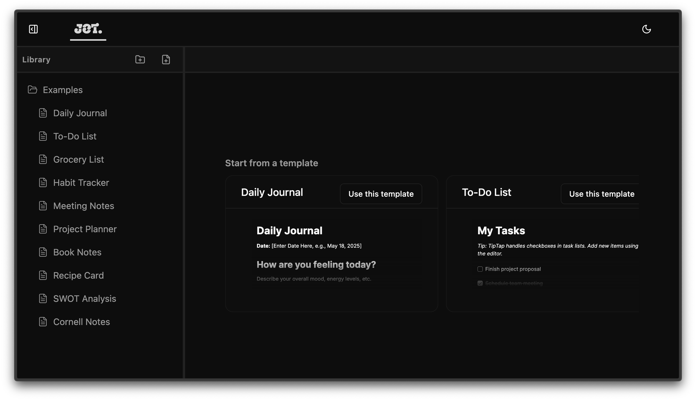
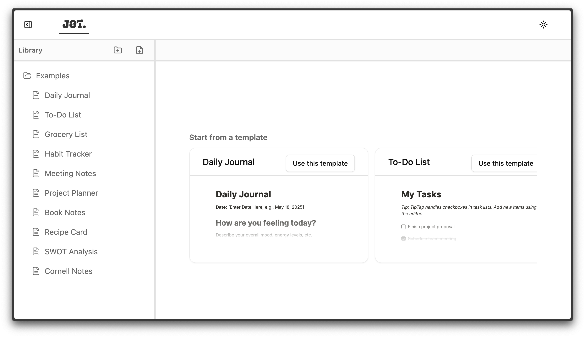
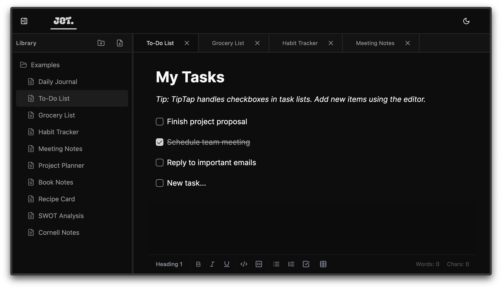
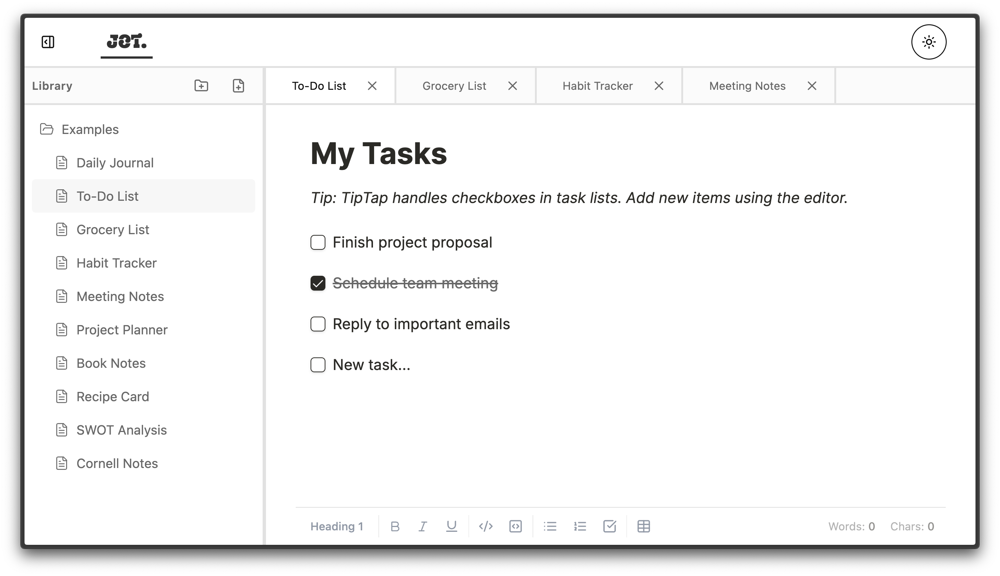

                                                                  ...::..
                       ..............    ....:::....    ..........:+###*=.
                       .-*##########+. .:+*##%%%%##*=   =*##########%%%%%.
                       .-##%%%%%%%%#+  =#%%%%%%%%%%%%#-  #%%%%%%%%%%%%%%#.
                       .:++*#%%%%%%#= =#%%%%%#=-=#%%%%%  #%%#*++++++++=-..
                        .....*%%%%*-  -+++++=:..:*%%%%%  #%#=:+++++-....
                     ...... .+####+:   -*##*=..:*%%%%%%+:    -#%%%%+:
                   .:+###*-..-====-   +#%%%%#+.:+#%%%%#:.    -#%%%%+:
                  ..+#%%%%#..+%%%%*: -*%%%%%#=...-===-:..    -#%%%%+:    ...
                  .:*%%%%#=.:*%%%%*: :*%%%%#=...+######-.    =#%%%%*-.  .-+**+-..
                  .:*%%%%#####%%%%*:  =#%%%%#####%%%%%#.   .=#%%%%%%*=  =#%%%%#=.
                   .:+#%%%%%%%%%#*:.   -*#%%%%%%%%%%#+.    :=%%%%%%%#=  +#%%%%#=.
                     .:=**###**+:..      :=**###**+-..     .-*******+-   +*##*=..
                       ..........         ...........      ...........   .......

                                                                          
          .+%%%%%%%%%%%%%%%%%%%%%%%%%%%%%%%%%%%%%%%%%%%%%%%%%%%%%%%%%%%%%%%%%%%%%%%%%%%%%*.
          .+#############################################################################+.

A minimal note-taking app built with React, TypeScript, and Tiptap.

[Demo](https://ashutoshtanwar1.github.io/jot/)

## Features

- Modern React-based application with TypeScript
- Clean, dark-mode-friendly UI
- Powerful markdown editor using Tiptap
- Formatting options (bold, italic, headings, code block etc)
- Dark mode toggle

## Screenshots

Here's a quick look at Jot in both dark and light modes:

|                 Home Page (Dark)                  |                  Home Page (Light)                  |
| :-----------------------------------------------: | :-------------------------------------------------: |
|  |  |

|                 File View (Dark)                  |                  File View (Light)                  |
| :-----------------------------------------------: | :-------------------------------------------------: |
|  |  |

## Tech Stack

- ⚛️ React (Vite)
- 📘 TypeScript
- 🎨 Tailwind CSS
- 🧩 shadcn/ui
- ✏️ Tiptap Editor
- 🌙 Dark mode support

## Getting Started

1. Clone the repository

   ```bash
   git clone https://github.com/ashutoshtanwar1/jot.git
   cd jot
   ```

2. Install dependencies

   ```bash
   npm install
   ```

3. Start the development server

   ```bash
   npm run dev
   ```

4. Open your browser and navigate to `http://localhost:5173`

## Project Structure

```
src/
  components/         # UI components
  design-system/      # Design system, reusable UI components, and design tokens
    components/
      ui/             # UI primitives and elements
    lib/              # Design system utilities and libraries
  editor/             # Tiptap editor components

public/               # Static assets
```
